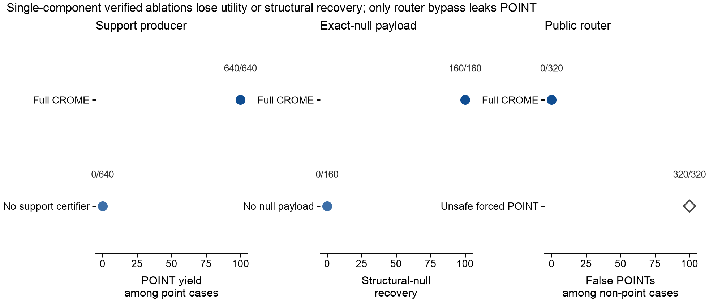

# CROME

**Target-Specific Recoverability Certification for Marked Event Responses under Coarsening and Overlap**

CROME is a certificate and output-routing layer for marked-event response
problems in which coarse observation schedules or overlapping responses can
make a requested target nonrecoverable. Each decision records three separate
axes: population structure (`IDENTIFIED`, `NONIDENTIFIED`, or `UNKNOWN`), the
tolerance-qualified operation (`POINT_AT_TAU`, `SET`, or `INCONCLUSIVE`), and
the certificate scope. The older four-state field is retained only as a
documented backward-compatible projection.

> 中文简介：本仓库是论文配套复现仓库，包含算法实现、冻结配置、
> 紧凑统计汇总、作图源数据和自动化测试。

[Release manifest](results/repository_manifest.sha256)



## Scope

The repository supports the paper's theoretical and module-level empirical
claims. The experiments cover aligned synthetic geometry and real Online
Retail II event timing under controlled coarsening with injected synthetic
responses. They do **not** establish a real-world causal effect, zero
population false-certification risk, end-to-end recovery from raw endpoints,
or production-scale performance.

## Repository layout

```text
.
├── src/                    # CROME implementation
├── experiments/            # CS experiments and the public release gate
├── configs/                # Frozen YAML configurations
├── tests/                  # Unit, integration, and artifact-audit tests
├── figures/                # Manuscript figure-generation code
├── results/
│   ├── summaries/          # Compact CS02 summary and generated gate report
│   ├── source_data/        # Tidy CS02 source table
│   ├── revision_20260812/  # Compact CS03--CS06 summaries and source tables
│   ├── figures/cs/         # Publication PDFs and PNG previews
│   └── repository_manifest.sha256
├── data/                   # Processed timing fixture and provenance metadata
├── scripts/                # On-demand data preparation
└── requirements-jss-lock.txt # Frozen replication environment
```

## Quick start

Python 3.10 or newer is required.

```bash
git clone https://github.com/98364/CROME.git
cd CROME

python3 -m venv .venv
source .venv/bin/activate          # Windows: .venv\Scripts\activate
python -m pip install --upgrade pip setuptools wheel
python -m pip install -e ".[dev,plot]"
pytest -q
```

For the frozen environment used for the archived scaling run, install
`requirements-jss-lock.txt` first and then install this package with
`python -m pip install -e . --no-deps`.

Run the fast smoke experiments in a disposable output directory:

```bash
crome-exp cs01 --mode smoke --outdir results/raw
crome-exp cs02 --mode smoke --outdir results/raw
python -m experiments.cs03_perturbation_grid
python -m experiments.cs04_online_retail
python -m experiments.cs05_scaling
python -m experiments.cs06_ablation
```

Main runs write full replication JSON under `results/raw/`. To keep the Git
repository compact, those generated ledgers are not tracked here; the
checked-in summaries and CSV tables support direct auditing of the reported
statistics, and the frozen configurations regenerate the full ledgers.

## Audit and regenerate the paper artifacts

```bash
# Verify compact evidence, hashes, figure copies, and smoke reproducibility.
python -m experiments.cs_final_gate

# Regenerate PDF, SVG, PNG, and TIFF outputs for the four manuscript figures.
python figures/cs_paper_figures.py
```

The compact Git release tracks PDF and PNG only; editable SVG and submission
TIFF files are generated on demand.

Large runs are configuration-driven and write a full JSON artifact, a compact
summary, and a tidy source-data CSV. For example:

```bash
crome-exp cs02 --mode main --outdir results/raw
python - <<'PY'
from pathlib import Path
from experiments.cs03_perturbation_grid import run

run("main", Path("results/raw"))
PY
```

The release manifest at `results/repository_manifest.sha256` binds the public
implementation, tests, configurations, processed fixture, compact result
tables, and figures.

## Data and license

An anonymized, minimized Online Retail II timing fixture is included so tests
and compact audits work offline. It contains a contiguous customer-group
index, source-naive event timestamps, and the derived mark; source customer
and invoice identifiers and raw transaction fields are excluded. The original
UCI archive and workbook are downloaded only when rebuilding the fixture;
attribution, source DOI, license, and hashes are documented in
[`data/README.md`](data/README.md).

The Python software is released under the MIT License. Cite the published
article when its final bibliographic record becomes available, and use this
GitHub repository URL when referring to the accompanying software and
reproduction package.
